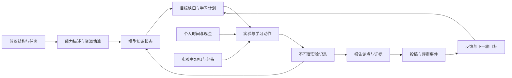

# Neural Blueprint 综合机制设计提案

## Current implementation audit

基线为 `4696a94becf96256efa24c7fbab0f367230aa15c`，资料核验截至 2026-09-09。本提案只设计后续系统；代码片段均为建议接口，不代表仓库已存在这些模块。当前实现细节分别见 [容量审计](01_EFFECTIVE_RANK_AND_ADAPTATION.md)、[知识图审计](02_KNOWLEDGE_GRAPH_REASONING.md)、[Lab审计](03_LAB_LIFE_SIMULATION.md)、[报告审计](04_REPORT_PAPER_SYSTEM.md)。

当前已有的主链是蓝图解析统计 → Inference Memory Profile → 多预算池、单阶段知识图模拟 → 训练曲线与训练耗时 → Lab日历。关键入口为 [updateState](../../src/blueprint/neuralBlueprint/analysis/updateState.ts#L7)、[InferenceMemoryProfile](../../src/blueprint/InferenceMemoryProfileTypes.ts#L62)、[useBlueprintDataController](../../src/blueprint/dataController/useBlueprintDataController.ts#L60)、[App.advanceTrainingTime](../../src/App.tsx#L65)。它没有真实神经网络训练日志，也没有完整科研项目与论文评审引擎。

| 子系统 | 已有基础 | 缺口与设计后果 |
|---|---|---|
| 蓝图 | shape、解析rank/variance、空间适配、复杂度、参数/FLOP/显存估算 | 统计有效性与点数资格需分开；失活与非法结构必须先确定，再计算预算 |
| 知识图 | 三类关系、物理预算守恒、掌握度、模拟loss/accuracy、分配/正则 | 正常入口stage=0；旧文档的多阶段语义不可作为MVP依赖；需独立目标规划输出 |
| Lab | 游戏时钟、工位/NPC、按日话题凭据、模拟GPU容量检查 | 无现金/科研经费分账、注意工时、队列或论文状态机；跨天训练未调用advanceLabDay |
| 报告 | `.rep`类型、桌面文件入口 | [App.tsx:102](../../src/App.tsx#L102) 只有blueprint workspace专门渲染，其他file仍回桌面；需新ReportDocument，不应复用nbp节点语义 |

`PROJECT_CONTEXT.md` 与代码冲突处以代码为准。尤其不要把模型的 complexity capability、知识图stage、训练epoch、日历semester 当成同一“等级”。代码中的 `[time,height,width]` 还包含输入时间轴，必须与玩家日历时间明确命名。

## Evidence-backed findings

以下是跨主题证据边界，不是将理论直接等同于游戏现实。

| 核心判断 | 证据及范围 | 强度 |
|---|---|---|
| 单个rank不能代表所有任务能力 | effective rank是谱集中度；LoRA、intrinsic dimension、神经塌缩各自测不同对象与任务，详见[01的原始文献](01_EFFECTIVE_RANK_AND_ADAPTATION.md) | Strong（概念区别）；Moderate（限定任务实验）；把它转换为点数是Design heuristic |
| 逆推应先解释/规划，再执行资源动作 | [Poole & Mackworth 2023](https://artint.info/3e/html/ArtInt3e.Ch5.S3.html) 的目标证明与[溯因章节](https://artint.info/3e/html/ArtInt3e.Ch5.S8.html) 的观测解释不同 | Strong（逻辑差异）；本项目模块边界为Design heuristic |
| 机时与现金不应混成同一可消费资产 | [北大HPC收费及奖励规则，2025](https://hpc.pku.edu.cn/guide_6.html) 有优先级计费、用途/期限约束 | Strong（该校制度）；向所有高校泛化为Weak。建议保留独立账本 |
| 论文应围绕论点与证据审查 | [ICML 2025 reviewer instructions](https://icml.cc/Conferences/2025/ReviewerInstructions)；不同venue具体边界见[04](04_REPORT_PAPER_SYSTEM.md) | Strong（该年官方规则）；固定加权分是Design heuristic，不是录用概率 |
| 评审有不确定性，制度应版本化 | [04中的NeurIPS/ICML/ICLR/JMLR官方标准](04_REPORT_PAPER_SYSTEM.md) 的评分、返修和artifact规则并不完全一致 | Strong（规则差异）；跨venue合并录用率无证据 |

现实参数只进入带 `region/year/population/sourceId` 的 preset；游戏参数只进入 `balanceVersion`。历史年份的收费、资助、会议日程可以用于历史剧本，不应包装成2026年所有学校/venue的现行规则。

## Design implications

### 1. 建议闭环



图上的反馈通过**新事件**推进，不能在同一次计算中无限循环。H更新C仅适用于对应模型的训练结果；报告对结果的评价不能反写出更高模型accuracy。玩家学习状态另表存储，由读书、练习、导师指导和可观察测试更新。

### 2. 现实/文献概念 → 游戏变量 → 当前或建议代码结构

| 现实/文献概念 | 游戏变量与单位 | 当前结构 / 建议结构 | 语义约束 |
|---|---|---|---|
| 参数自由度 | `activeParameterCount`，参数个数 | 当前[trainingResources.ts](../../src/blueprint/neuralBlueprint/analysis/trainingResources.ts#L59) `parameterCount`；建议对输出可达且可训练参数计数 | 不是直接记忆点；无效/冻结/未连接参数分开 |
| 谱多样性 | `representationDiversity`，无量纲有效维度 | 当前[updateInferencePoints](../../src/blueprint/neuralBlueprint/analysis/updateInferencePoints.ts#L16)使用rank代理；建议ProbeStatistics | 必带矩阵对象、归一化、探针数据、时间点 |
| 游戏训练容量 | `capacityBudget`，整数点 | 当前 `InferenceMemoryGroup.memoryPoint`；建议CapacityDescriptor | 与显存MiB、玩家知识无兑换恒等式 |
| 梯度/信号传播 | `optimizationHealth`，0..1及unknown | 当前[InferenceMemoryVariance.ts](../../src/blueprint/InferenceMemoryVariance.ts#L40)→SGD skip；建议独立健康状态 | unknown不是健康1，Adam不能作为科学理由屏蔽所有问题 |
| 空间归纳偏置 | `taskFit`，0..1或显式适配格 | 当前[SpatialAdaptationTypes](../../src/blueprint/SpatialAdaptationTypes.ts#L1)、`adaptationCapability` | source-coordinate跨度须与任务数据同标尺 |
| 推理结构复杂度 | `structuralComplexity`，无量纲代理 | 当前group `complexityCapability`、节点 `inferenceTopologyOrder` | 不等同教育年级、epoch或知识图阶段 |
| 模型技能状态 | `modelMastery`，0..1模拟刻度 | 当前[KnowledgeGraphMemory/ReasoningStageEstimate](../../src/blueprint/knowledgeGraph/model/reasoning.ts#L23) | 不是玩家能力后验概率 |
| 人的技能证据 | `learnerBelief`，概率分布/unknown | 当前无；建议LearnerBelief、ObservationEvent | 由题目和观测模型校准，重复答案需去重 |
| 学习依赖 | `PrerequisiteRule`，AND/OR和threshold | 当前[types.ts](../../src/blueprint/knowledgeGraph/model/types.ts#L46) dependency是软成本边；建议新规则表 | 不自动把所有旧边变硬门槛 |
| 替代与知识混淆 | `transferScope`, `confusionRisk`，无量纲 | 当前substitute/interference；建议有方向范围/辨析动作 | 混淆不是逻辑矛盾、替代不是完全等价 |
| 个人生活资金 | `cashCny`，人民币元 | 当前无；建议PersonalBudget | 奖学金依资格与发放日，不能保证每人获奖 |
| 受限科研资源 | `grantCny`, `computeCredit{amount,unit,resourceClass,expiresAt}` | 当前无；建议LabGrant/QuotaLedger | unit为CNY或gpuHour，科研额度可能按元计价；用途限制、到期、不可提现；奖助与报销不得重复记收入 |
| 日历 | `gameMinute`，分钟 | 当前[GameTime](../../src/game/gameTypes.ts#L3)、[academicTime](../../src/time/academicTime.ts#L21) | 当前20周/学期是游戏历法；现实日期用带时区calendar profile |
| 主动工作与科研专注 | `attentionHours`、其子集`focusedResearchHours`，人时 | 当前无；建议TimeLedger/ActionReservation | 主动工作包括课程/会议/管理；GPU等待可与写作重叠，同一人时不可重复占用 |
| GPU能力 | `vramMiB`, `effectiveTflops`, `deviceCount` | 当前[DEFAULT_TRAINING_SERVER](../../src/blueprint/neuralBlueprint/analysis/trainingResources.ts#L16)；建议GpuDevice/Partition | 显存以设备/分片判定；不能简单把不互通卡显存相加 |
| GPU任务 | `workFlops`, `queueMinutes`, `serviceMinutes` | 当前 `estimateTrainingRun`；建议GpuJob | 队列等待与训练服务分离；0有效样本不得变成真实训练 |
| 实验室实体 | `workstationId`, `serverId`, `mentorMinutes` | 当前[labSceneLayout.trainingCapacity](../../src/lab/labSceneLayout.ts#L94)只是画面服务器数；建议资源实体驱动画面 | 不用摆设数量直接当GPU性能 |
| 同门生命周期 | `programStage`, `expectedExitWindow`, `attendanceState` | 当前[LabProgress](../../src/lab/labTypes.ts#L47)和[graduateLabSenior](../../src/lab/labProgress.ts#L58) | 毕业需日历/项目条件，不能每日均匀永久消失 |
| 可复现实验 | `ExperimentRun`，版本化记录 | 当前lossHistory；建议不可变run/metrics/assets | simulated与externalMeasured来源必须显式区分 |
| 论文主张 | `ClaimModule`, `EvidenceModule` | 当前无Report工作台；建议ReportDocument.modules | 同一实验拆成多模块不能变成多份独立证据 |
| 审稿 | `eligibility`, `dimensionScores`, `uncertainty` | 当前无；建议VenueProfile/ReviewAssessment | eligibility三值，分数非录用率，reviewer preference与事实风险分开 |
| 投稿过程 | `SubmissionAttempt`，日期与状态 | 当前无；建议ResearchProject/SubmissionAttempt | rejected不是实验资产消失；rebuttal依该venue规则补充 |

### 3. 数据接口与所有权

建议新增独立 domain 层，初期放在现有存储适配器之后，不在所有 React node.data 上复制状态。下述目录只是建议，不要求本次创建。

```text
src/domain/capacity/       CapacityDescriptor, ProbeStatistics
src/domain/reasoning/      GoalSpec, ReversePlan, PrerequisiteRule
src/domain/research/       ResearchProject, ExperimentRun, EvidenceAsset
src/domain/lab/            BudgetLedger, ResourceReservation, GpuJob, NpcState
src/domain/report/         ReportDocument, VenueProfile, ReviewAssessment
```

```ts
type EvidenceStrength = 'Strong'|'Moderate'|'Weak'|'Design heuristic';
type ParameterRecord = {
  key:string; unit:string; value?:number;
  prior?:{family:string; parameters:Record<string,number>};
  bounds:[number,number]; scope:{year?:number;region?:string;population?:string};
  sourceIds:string[]; evidenceStrength:EvidenceStrength; balanceVersion:string;
};
type CapacityDescriptor = {
  modelRevision:string; taskRevision:string; formulaVersion:string;
  validity:'valid'|'invalid'|'unknown'; issues:string[];
  capacityBudget:number; optimizationHealth:number|null;
  taskFit:number|null; compute:{vramMiB:number;workFlops:number};
  statisticsOrigin:'analyticProxy'|'probeMeasured';
};
type ExperimentRun = {
  id:string; revision:string; origin:'simulated'|'externalMeasured';
  blueprintRevision:string; taskRevision:string; datasetSplitHash:string;
  seeds:Array<{role:'graph'|'initialization'|'split'|'training'|'other';value:number|string}>;
  formulaVersion:string; environment:Record<string,string>;
  startedMinute:number; finishedMinute:number;
  metrics:Array<{name:string;value:number;unit:string;split:string;
    sampleCount?:number;uncertainty?:[number,number]}>;
  resourceReceiptIds:string[]; artifactIds:string[];
};
type ReportDocument = {
  id:string; schemaVersion:number; kind:string; studyMethod:string; revision:string;
  profileId:string; moduleIds:string[]; edges:ReportEdge[];
  submissionAttemptIds:string[];
};
```

模块注册表及`ReportEdge`的枚举与验证规则以[04](04_REPORT_PAPER_SYSTEM.md)为准；`profileId` 指定 venue/year/phase 或课程rubric，`ExperimentRun` 永不被报告编辑就地篡改。补跑实验产生新run并通过 supersedes/link 表关联旧run。`formulaVersion` 切换必须显示“新模型版本”，不能让同一份历史曲线默默变值。

事件有全局唯一 `eventId`、发生时间、输入revision、rngStream和资源凭据。一个实验结束只落一次账；话题奖励沿用现有 `encounterId` 去重思想，但奖励到账状态与receipt分开。三个随机流建议为 `training/events/review`，避免多点一次NPC对话就改变下一次模型训练抽签。

## Candidate models/formulas

### 1. 四变量的使用位置

`capacityBudget` 是可分配的存量上限；`optimizationHealth` 决定单位学习动作的增益/失败风险；`taskFit` 描述架构与任务需求相符程度；`computeCost` 决定能否运行及耗时。推荐只在定义清楚的一处施加某个效应：若 taskFit 已用于学习增益，就不要未经消融又在容量和正则各惩罚一次。

预算绝不通过lab现金直接购买抽象“有效秩”。资金购买GPU服务，服务允许更多/更大的实验，实验结果改变后续决策；玩家仍需选择模型与证据。这条中介路径让资源策略可解释。

### 2. 推荐公式与参数范围汇总

下表的区间均为首轮敏感性分析范围，除明确标为现实来源的项目外均为 **Design heuristic**。不以表中区间推定现实人口或神经网络普适常数；具体容量候选系数以[01](01_EFFECTIVE_RANK_AND_ADAPTATION.md)为准。

| 变量/机制 | 推荐表达式 | 单位、范围及边界 | 成本/依据 |
|---|---|---|---|
| 容量预算 | `C=floor(C_ref*b*ln(1+P_active/P_ref)/ln(2))`，`b=min(1,d_path/max(d_required,1))` | C_ref扫64..256点；P_ref为固定参考参数数；d_required>=1为任务需求维度，d_path为结构瓶颈代理；无有效路径/全失活为0 | 活跃图遍历O(V+E)，共享参数去重；Design heuristic；纯线性链瓶颈取最小宽度，Sum不得按Concat处理，详见01 |
| 适配/健康 | `deltaMastery=min(1-currentMastery,baseRate*attentionHours*health*fit)`，health/fit各0..1 | baseRate>=0，单位掌握度/人时；deltaMastery无量纲；结构性不可学习时health=0，单次loss梯度0不足以判定；未知保留null | O(1)/实体；设计版本需与当前0.01..1.1适配因子迁移区分 |
| 知识成本 | `C_i=c_i*(1+alpha*weightedMean(1-m_u*q_e))` | c,C为点，alpha扫0..3；无依赖成本=c，最大(1+alpha)c | O(N+E)/snapshot；[02模型A](02_KNOWLEDGE_GRAPH_REASONING.md) |
| 前置规则 | AND取最弱归一化readiness；OR取一条完整可达路线 | threshold扫0.5..0.9；0阈值自动满足；分数非概率 | O(规则条件数)，最优共享路径另需组合搜索 |
| 小步规划 | `gain=(J_before-J_after)/deltaPoints`，J为加权目标缺口+过拟合代价 | delta=1..4点，eta=0..1；候选K=8..32；负收益允许停止 | O(K*T_forward)；Design heuristic |
| 日历与工时 | `availableAttention=max(0,scheduledHours-reservedHours)` | 底层整分钟，预约格30分钟、动作30..120分钟；普通档主动工作40..44h/周，其中科研专注24..36h；48h仅deadline档 | 资源守恒；全为游戏假设，非研究生真实均值 |
| 实验工作量 | `workFlops=forwardFlopsPerSample*trainFactor*samples*epochs` | FLOP；trainFactor先扫2..4（当前=3），须按训练方式标定 | O(V+E)结构估算；真实探针校准；零样本拒绝创建实测run |
| 服务时间 | `serviceSeconds=startupSeconds+ioSeconds+workFlops/(deviceCount*effectiveTflops*1e12*scalingEfficiency)` | 秒；deviceCount>=1、吞吐>0、scalingEfficiency∈(0,1]；无卡进入queued；不适合多卡时deviceCount=1 | O(1)，系数待测；有效吞吐已扣单卡利用率；不得混用TFLOP与TFLOP/s |
| 显存 | `peakMiB=(paramBytes+gradBytes+optimizerBytes+activationBytes+workspaceBytes+runtimeBytes)/2^20` | MiB；按任务/精度/优化器profile；实测峰值安全余量扫1.1..1.3倍，未校准估算按03扫1.1..1.5倍 | 估算不是所有框架恒等式；OOM与排队分别处理 |
| GPU账单 | `chargeCny=pricePerGpuHour*billableGpuHours` | 元；同价共享系统根据预约/实际政策设计费；校园示例[北大2025](https://hpc.pku.edu.cn/guide_6.html)3090为2/3/4元、80G为4/6/8元每卡时 | Strong限该制度；商业云另按日期/地区/机型询价 |
| 现金变化 | `cashNext=cash+paymentsReceived+reimbursementsReceived-personalChargesPaid` | 元；按唯一receipt结算，垫付款只扣一次；有资格不等于已到账；年额/月额分开 | O(事件数)；现实preset与游戏初始缓冲分开 |
| 连续状态时长 | `duration ~ LogNormal(mu,sigma)`或Triangular(min,mode,max) | 天或人时明确其一；未校准用专家区间，不称统计置信区间 | O(1)采样；投稿等待期间不扣满专注工时 |
| 条件结果概率 | `p_stage~Beta(alpha,beta)`；有同口径历史后更新 | [0,1]；无数据Beta(1,1)或标记未校准，首轮不输出2位小数的伪精度 | 阶段样本可比才更新；存在withdraw时用多项转移模型 |
| 论文连续质量 | `S=clip(100*sum_d(w_d*q_d)-P,0,100)`，`P=min(Pmax,sum_uniqueRootCause max penalty)` | q为0..1、权重和1；Pmax扫10..20分；每问题只由一个维度或penalty负责，防双扣；未测维度扩大区间 | O(M+R+引用/覆盖匹配)，语义判断需人工；Design heuristic |
| 资格门槛 | `eligibility=fail if any fail; unknown if any unknown; pass otherwise` | 三值分类，不作0..100相加 | O(gates)；真正hard gate按venue/year/phase配置 |

不把所有质量维度视为独立随机变量。重复seed、同数据集不同图表、同一评审人多个评分存在相关性；uncertainty区间可采用组层级bootstrap或明确相关矩阵的模拟。无数据时用宽情景区间，标“设计情景”，不得标“95%置信区间”。

实证论文初始权重依次为：问题价值10%、相关工作8%、正确性20%、新颖性12%、实验15%、统计10%、复现10%、清晰7%、图表3%、局限3%、伦理2%，总和100%；伦理违规由hard gate处理，2%不代表违规可忽略。其他材料/venue见04的profile。若维度q处于[l,u]、惩罚处于[Pl,Pu]，保守分数范围为 `[clip(100Σwl-Pu,0,100), clip(100Σwu-Pl,0,100)]`，是rubric范围，不是录用概率或统计置信区间。

### 3. 参数依赖与单位检查

```text
blueprint topology, task input shape -> P_active, A, FLOP, validity
P_active, bottleneck, capacityCalibration -> capacityBudget
probe/stat proxy, taskRequirements -> health, fit
capacityBudget -> pool allocation constraints
allocation, graphRules, health/fit learning events -> modelMastery
modelMastery, target gaps -> reverse plan (read only)
chosen plan, time, GPU, funding -> ExperimentRun
ExperimentRun + ClaimScope + VenueProfile -> ReportAssessment
ReportAssessment + cohort/venue policy + review variability -> SubmissionAttempt
```

推荐不变量：

1. 所有 `log/exp/sigmoid` 的输入必须无量纲；当前 `log(requiredMemory)` 的尺度问题用02的替代式验证。若保留对数，写成 `log(C/C_ref)`，C_ref与C同单位且随单位变换。
2. 节点/边分配的总和不超过所属预算池；一次活动若有多个目标，按动作/资源凭据ID结算一次。
3. `vramMiB` 与 `capacityBudget` 永不比较；1GiB=1024MiB，商品规格GB与GiB要在adapter中显式转换。
4. `effectiveTflops` 的完整单位为10^12 FLOP/秒；FMA计1还是2在probe元数据固定；当前成本估算采用乘加约2 FLOP，不能与不同口径benchmark直接比较。
5. 学习增益用专注小时；队列用日历分钟；并行任务经过资源预约图处理。等待GPU一整天不等于连续研究24小时。
6. 论文质量分和录用事件分开；同一个质量向量可以因venue适配和reviewer噪声有不同结果，但数据造假/缺失证据不能靠运气转为已验证事实。
7. 现实模式换地区/学校只换有来源的预算约束和日程；游戏模式改变压缩比/保底机制必须显示模式名，旧存档保留profile版本。

### 4. 两种模式

**现实模式**：按具体学校/年份/学段preset、真实日历和报价运行；资助按资格与发放节奏，合同/项目经费有用途约束，投稿等待保留现实范围；不模拟为全国平均生活。缺事实值标“待选择/待校准”，不给假的精确默认。长期等待可快进，但并行活动仍记账。

**游戏化模式**：保留资源冲突、证据要求、稿件退修与不确定性；将现实周/月压缩为少量可见动作，允许低资源备用路线、基础生活保障和可解释的救济事件。随机失败主要改变资源/时间与路线，不销毁已有知识、实验和写作资产。压缩时长和保底机制均为 **Design heuristic**。

同一局不随失败暗改“现实概率”；若有动态难度，只调整可获得的帮助与任务选择并显式记事件，不修改过去实验数值或把拒稿重新判成录用。

## Recommended MVP

### 1. 最小可玩纵向切片

范围：一个教学任务、一个可用GPU资源、1–3位可互动同门、一个课程/实验报告profile，完整贯通“目标→蓝图→训练模拟→实验记录→论点/证据→提交反馈”。这不是立即做顶会论文录用模拟。

1. 明确 `origin=simulated`，保留现有图操作；加入预算、健康、适配、资源四项可解释说明。
2. 逆推生成目标缺口和2–3个候选动作；选择动作才消耗资源，按02的冻结快照和有限差分验证。
3. 一次训练生成不可变ExperimentRun；图、数据集、种子和公式版本齐备。null验证点保留为空。
4. `.rep`最少能包含问题/方法/实验/结果/讨论/引用，并能引用ExperimentRun；报告不同材料类型走独立profile。
5. 评分输出结构缺口、论点支持情况、质量维度及unknown；反馈后允许补实验和新revision，旧记录保留。
6. 日历跨天事件连接NPC到场/资源预约；一个受限GPU额度账户和个人现金分开。先实现资源守恒，不先设计几十种随机事故。

以上是 **Design heuristic**。首版的乐趣来源是选择学习/实验路径和解释证据，而不是把复杂公式直接暴露给玩家。

### 2. 三阶段路线图

| 阶段 | 优先工作 | 完成门槛 | 暂不承担 |
|---|---|---|---|
| MVP | 冻结审计基线、参数元数据、死网络/预算边界、单阶段逆推、实验记录、简单.rep、资源分账与跨日事件 | 预算守恒/幂等、不可达目标可解释、重复模块不加证据分、相同seed可重放；所有模拟值可追溯 | 真实神经训练预测、全套社会模拟、通用录用率 |
| 第二阶段 | 探针activation统计与任务线性probe、BKT/IRT玩家练习、AND/OR路线、GPU队列、科研项目状态机、多venue评分profile | 留出任务上的容量预测优于参数量基线；推荐优于随机/当前utility；队列/财务回放一致；评分与专家评审差异可解释 | 自动证明论文新颖性、无数据因果发现 |
| 长期研究版 | Jacobian/KFAC谱模型、干预课程发现、异构GPU调度、submission cohort模型、外部实验artifact导入、完整论文工作台 | 外部任务验证、概率校准、系统性失效报告、跨地区profile维护与人工复核 | 以模型模拟代替现实证据；无说明的数据/公式变更 |

推荐顺序：先 P0 不变量与语义纠偏，再 P1 纵向切片，再 P2 校准模型。若基线不通过死网络/单位测试，应先冻结其对玩家收益的影响，再考虑更复杂rank估计；不把更多理论复杂度当作修复边界错误的替代。

## Validation plan

以下10项按信息价值排序，均为后续实验计划，本次仅文档审计，没有构建或运行应用。所有比较需固定版本、任务与种子；探索阶段找参数，验证阶段用未见任务/图/受试者，禁止用调参样本报泛化。

| 优先 | 可证伪假设 | 最小设计、记录与推翻条件 |
|---|---|---|
| 1 | 确定无可学习通路的结构不能产生训练收益 | 构造dropout=1阻断全部参数到目标通路、断开输出、非法shape；明确排除可学习bias与旁路，并区分一次loss梯度为0和整个参数到输出Jacobian为0。逐层记录rank/variance/budget；确定失活却允许产生学习增益即推翻；当前静态推导已提示风险 |
| 2 | rank代理比简单参数量更预测学习 | 小型MLP/CNN/残差网×低维/噪声/分类任务，记录实际loss、泛化、probe rank；模型选择在一组任务、报告在另一组。未稳定优于P_active基线则保留为可视化描述而非容量引擎 |
| 3 | 已知恒等包装、共享引用和换单位不改变机制结论 | 原图/节点重排/共享参数引用/恒等包装/记忆量整体×10；比较预算、mastery、推荐。超出浮点及整数粒度解释的变化推翻；独立可训练分支虽暂时输出相同，仍可能增加函数自由度，不能归入不变性要求 |
| 4 | 目标逆推节省有限预算 | 小图可枚举最优；当前utility、深度、随机、逆推+差分配对seed；比较达到目标的点数/人时与失败路径。无稳定改善或解释错误则不进入默认 |
| 5 | 适配、健康、容量应独立调节 | 2×2×2因子消融，固定FLOP和参数；检查是否重复惩罚。单一变化同时从多处扣除导致不可解释的骤降，推翻当前组合方式 |
| 6 | GPU与时间估算足以支持决策 | 选择小MLP/CNN、固定硬件精度batch，实测峰值和每步/epoch时长；至少多个重复。比较相对误差与是否误判OOM；超目标误差则扩大区间或改分类模型，不显示虚假精度 |
| 7 | 队列、账本与日历保持守恒 | 两任务共享一GPU、跨午夜、暂停/重载/重复完成事件；检查GPU-hour、现金、额度、专注时间与NPC刷新次数。任何重复扣费/发奖/任务完成即失败 |
| 8 | 报告不能靠堆模块刷分 | 同一结果复制为10个模块、换引用标题、删关键对照、断开Claim→Evidence、加入反证。复制不加独立支持分；删除关键证据必须改变eligibility/uncertainty/质量，否则失败 |
| 9 | 自动反馈与人类质量判断有可解释关联 | 若干已许可报告，由至少两名独立评阅者使用同一rubric；看维度一致性和错误案例，不以录用预测AUC代替正确性。自动系统把空论点/无效对照评高分即回退人工提示 |
| 10 | 游戏模式保留选择而不制造死局 | 低/中/高资助×GPU拥堵×mentor支持的脚本仿真与小规模试玩；记录可行替代路线、无动作日数、任务弃置和理解度。失败后普遍无路径或最优策略永远是等待/刷NPC，推翻平衡参数 |

随机仿真先采用至少20种子查看方差与失败模式；真实网络可先3–5种子估成本，再根据效应/方差扩充，不能把固定次数写成统计保证。真实用户/评阅研究通过先导样本估方差、预登记主要指标并做功效分析；小样本先报告描述性结果，不上升为教育因果结论。

校准记录至少含：假设、图/任务版本、参数来源/先验、数据划分、重复单位、比较基线、主要指标、停止规则、结果不确定性、失败案例。建议`CalibrationRecord`只更新未来balanceVersion，不回写旧ExperimentRun。

## Risks, unknowns, and rejected alternatives

- **最高风险：不同层级的同名指标混用。** 实际模型准确率、模拟掌握度、玩家知识、论文质量都可以是0..1，但其观测与意义不同。接口应借助不同类型/ID命名空间约束，不能仅以number互传。Strong（审计与定义）。
- **证据漂移。** 学校补助、云价、会议日程逐年变；来源必须保存发布日期/适用期/核验日。未找到全国可泛化的CS研究生生活费、竞赛退出率和各论文阶段成功率，应把缺口保留为unknown。Strong（现有证据不足的范围声明）。
- **拒绝统一“科研值→论文录用概率”公式。** 科研结果可能正确但不适合venue；新颖性、问题价值与审稿偏好不能从模块数和GPU时长推导。建议规则分层与人工评议，Design heuristic。
- **拒绝容量无限可叠加。** 共享引用、已知恒等包装、无用GPU或重复实验证据不得自动增加能力。独立可训练分支需另评估；A的参数量公式也不保证任意线性因子重参数化不变，应识别已知可折叠重复块并在对照中声明限制。
- **拒绝让收入、毕业和投稿都逐日独立抽签。** 学段、项目阶段、资格和日历形成条件依赖；无数据的hazard只可当玩法参数，不能加“据统计”。
- **不要一次完成全部结构迁移。** 先以adapter读取现有profile与loss，保留存档version，独立添加事件与报告；若重新启用阶段，迁移必须明确从stage0分配如何构造后续阶段而不增预算。
- **仍需决策的数据。** 哪些任务/网络是真正目标、游戏期望时长、默认地区学校、可收集的probe/玩家数据、是否导入外部实验，目前不决定其现实概率。本提案给出可配置结构与验证路径，不把缺失信息伪装成固定常数。

参考来源按主题列于 [SOURCES.md](SOURCES.md)；各主题的具体公式、参数、适用范围和被拒方案以[01](01_EFFECTIVE_RANK_AND_ADAPTATION.md)、[02](02_KNOWLEDGE_GRAPH_REASONING.md)、[03](03_LAB_LIFE_SIMULATION.md)、[04](04_REPORT_PAPER_SYSTEM.md)为详细依据。
